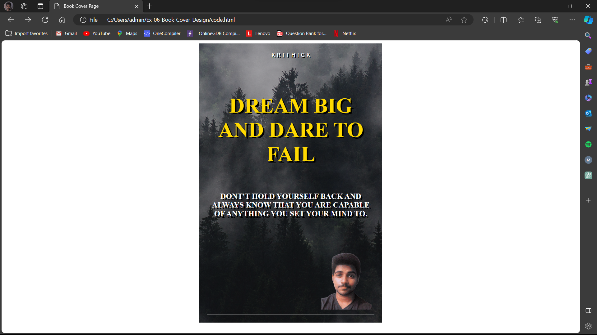

# Ex-06-Book-Cover-Design
# AIM:
Design a book cover page using HTML and CSS.
# PROCEDUCE:
## STEP-1:
Create a new Django project and app.
## STEP-2:
Create a static file directory and mention the changes in settings.
## STEP-3:
Make a new folder templates inside your app and create a html and map them using views and url.
## STEP-4:
Write down the code for book cover using HTML and CSS.
## STEP-5:
Add images and other contents using CSS record a screenshot of it.
# PROGRAM:
## HTML Code:
```html
<!DOCTYPE html>
<html>
    <head>
        <title>Book Cover Page</title>
    </head>
    <link rel="stylesheet" href="style.css">
    <meta name="viewport" 
    content="width=device-width, initial-scale=1.0">
    <link rel="preconnect" href="https://fonts.googleapis.com">
    <link rel="preconnect" href="https://fonts.gstatic.com" crossorigin>
    <link href="https://fonts.googleapis.com/css2?family=Caveat&family=Dancing+Script:wght@600&family=Ephesis&family=PT+Serif:wght@700&family=Preahvihear&family=Roboto+Mono:ital,wght@1,700&family=Rubik+Doodle+Shadow&family=Vina+Sans&display=swap" rel="stylesheet">

    <body>
        <div class="book_page">
            <div class="name">
              K  R  I  T  H  I  C  K
            </div>
            <div class="title1">
                <h1>DREAM BIG AND DARE TO FAIL</h1>
            </div>
            <duv>
                <h6 class="tips">DONT'T HOLD YOURSELF BACK AND ALWAYS KNOW THAT
                     YOU ARE CAPABLE OF ANYTHING
                     YOU SET YOUR MIND TO.</h6>
            </duv>
            <div class="image">
                
            </div>
            <div>
                <hr>
            </div>

        </div>
    </body>
</html>
```
## CSS Code:
```css
.book_page{
            
    width: 430px;
    height: 680px;
    background-color: antiquewhite;
    color: bisque;
    margin-left: auto;
    margin-right: auto;
    padding: 20px;
    background-image:url(final.png);
    background-size: cover;
}
.name{
    color :rgb(255, 255, 255);
    font-family: 'Trebuchet MS', 'Lucida Sans Unicode', 'Lucida Grande', 'Lucida Sans', Arial, sans-serif; 
    position: relative;
    text-align: center;
    text-shadow: 2px 2px  rgb(0, 0, 0) ;
}
.title1{
    display: grid;
    grid-template-columns: 5fr;
    grid-template-rows: 5fr;
    position: relative;
    text-align: center;
    font-size: 15px;
    margin: solid none;
    text-wrap: wrap;
    text-shadow:4px 4px rgb(0, 0, 0);
    padding: 10px;
    color: rgb(255, 217, 0) ;
    font-size: 27px;
    
    margin-top: 45px;
    font-family: Afacad;
    ;
}
.tips{
font-size: 20px;
color: rgb(255, 255, 255);
text-align: center;
top: 300px;
border:1px;

margin-top: 20px;
text-shadow: 4px 4px rgb(0, 0, 0);

}
.image{
position: relative;
top: -1px;
left:293px;


margin-top: 72px;


}
```
# OUTPUT:

# RESULT:
Thus the book-cover-design has been successfully created using HTML and CSS.